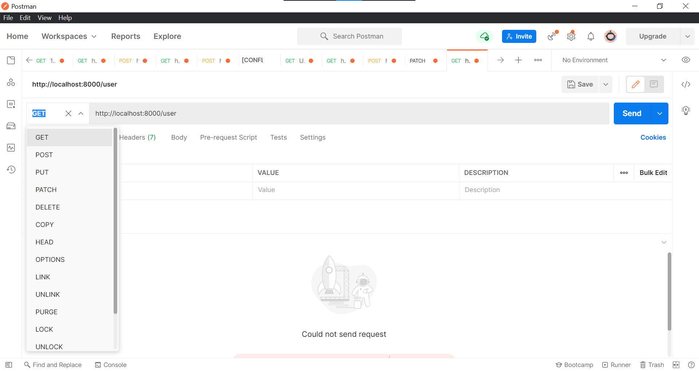

# Курс java

## Работа с репозиторием

Каждому участнику будет создана ветка в этом репозитории. В эту ветку нужно делать **pull request** с решением задания.

Плана такой:

* Делаем **fork** этого репозитория. После чего у вас должна появится копия этого репозитория.
* Задания выполняем в своем репозитории.
* Каждое задание должно размещаться в одном репозитории в соответствующем с номером задания папке (**task1, task2,
  ...**). Каждая такая папка должна быть как независимый проект, или модуль (То есть внутри папка src и т.д.).
* После выполнения задания вы пушите изменения в свой репозиторий. После чего создаете **pull request** в этот
  репозиторий в свою ветку.

## Задача 1

Есть список картинок. У каждой картинке есть уникальный идентификатор (**id**). Пользователь может удалить любую
картинку, вставить в любое место новую картинку, перейти на другой экран с другим списком картинок, или ничего не
делать.

Даны два списка **id**: старый и новый. Где **id** представляет собой целое число. Нужно определить какая из ситуаций
произошла.

Более подробно о ситуациях:

* Пользователь ничего не сделал. Все элементы старого списка равны элементам нового списка.
* Пользователь добавил новую картинку. За раз добавить можно только одну картинку. В этом случае нужно также указать на
  какой позиции оказался новый элемент.
* Пользователь удалил картинку. За раз удалить можно только одну картинку. В этом случае нужно также указать из какой
  позиции удалена картинка.
* Пользователь перешел на другой экран. Случай когда списки отличаются более чем на одну позицию.

Метод реализации, способ использования, а также метод получения ответа на ваше усмотрение. Нужно предусмотреть то, что
код может использоваться в разных частях проекта. Также необходимо добавить **Main.java** с примером использования
вашего решения.

**UPD:** Мы рассматриваем только одно действие. Задача реализовать метод с помощью которого можно определить какое
действие было совершено. Старый список - это список до действия, новый список - это список после действия. Действие это
одна из 4 описанных ситуаций.

Примеры:

до:    1, 2, 3</br>
после:    1, 3</br>
произошло действие удаление картинки</br>
______________</br>
до:        1, 2</br>
после 1, 3, 2</br>
произошло действие добавление картинки</br>
______________</br>
до:        1, 2, 3</br>
после:    1, 2, 4</br>
произошло действие перехода на другой экран

## Задача 2

В рамкой этой задачи вам нужно разобраться с библиотекой **Lombok**. Почитать можно
например: https://javarush.ru/groups/posts/2753-biblioteka-lombok или https://java-lessons.ru/lombok/usage

* Настройте проект с использованием maven и туда включите библиотеку lombok. Как включить lombok в maven можно почитать
  по ссылке: https://projectlombok.org/setup/maven.
* Создайте тестовый класс (можно один или несколько)
  применив `@Getter, @Setter, @Data, @ToString, @NoArgsConstructor, @RequiredArgsConstructor, @AllArgsConstructor`

## Задача 3

* Установите и настройте базу данных PostgreSQL.
* Настройте Hibernate для работы с базой данных.
* Реализуйте сущность User с полями: id, email, name, birthday.
* Реализуйте http сервер с операциями над User. Реализовать нужно CRUD(create, read, update, delete) запросы.

Результат необходимо вывести в формате **json**. Для перевода **java** класса в **json** и обратно можно воспользоваться
библиотеками
**gson** или **jackson**. В этом задании, для простоты **birthday** пусть пока будет **String**.

Пример:

```java
import java.time.LocalDate;

import lombok.AllArgsConstructor;
import lombok.Data;

@AllArgsConstructor
@Data
class User {
    private Long id;
    private String email;
    private String name;
    private String birthday;
}
    ///////////////////////////////
    Gson gson = new Gson();
    User user = new User(1, "test@test.test", "Test", "01.12.1998");
    String json = gson.toJson(user); // превращаем объект в json строку

    User user = gson.fromJson(json, User.class); // превращаем json строку в объект
```

Для тестирования запросов можно воспользоваться программой Postman.


Запросы должны быть следующими:

* **get**

http://localhost:8000/user - получить всех пользователей. Пример результата:

```json
[
  {
    "id": 1,
    "email": "test@test.test",
    "name": "Test",
    "birthday": "20.04.1979"
  },
  {
    "id": 2,
    "email": "test2@test.test",
    "name": "Test 2",
    "birthday": "25.02.1989"
  }
  // ...
]
```

http://localhost:8000/user/{:id} - Получить пользователя c указанным id. Пример результата:

```json
{
  "id": 1,
  "email": "test@test.test",
  "name": "Test",
  "birthday": "20.04.1979"
}
```

* **post**

http://localhost:8000/user - Создать нового пользователя. Данные пользователя передаются в теле запроса в качестве json.
В качестве информации о пользователе **не передается** id пользователя, так как id генерирует база данных. В качестве
ответа отдается созданный пользователь в json.

* **put**

http://localhost:8000/user - Изменить пользователя. Новые данные пользователя передаются в теле запроса в качестве json.
Изменить нужно пользователя, id которого прописан в модели. В качестве ответа отдается измененный пользователь в json.

Пример запроса в **Postman** для post/put:


* **delete**

http://localhost:8000/user/:id - Удалить запись из базы данных с указанным id. В качестве ответа ничего возвращать не
нужно.

Пример в **Postman** delete:

